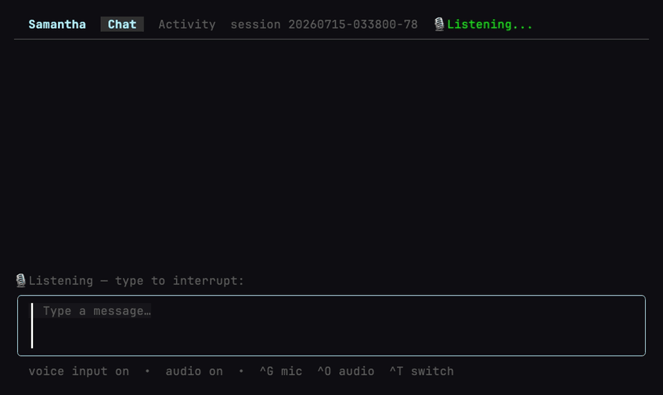

# Samantha

Samantha is a low-latency voice assistant.

It captures speech, transcribes it locally, streams the prompt through an AI coding backend, chunks the response into sentences, and speaks those sentences as soon as they are ready.



## Features

- Local speech-to-text with sherpa-onnx Whisper by default.
- Optional streaming STT through sherpa-onnx Zipformer and utterance-final STT through whisper.cpp.
- Local text-to-speech with Kokoro through sherpa-onnx.
- Optional native Qwen3-TTS through an externally installed CLI/worker (Kokoro remains the default).
- Claude CLI and Ollama brain providers.
- Voice activity detection with Silero.
- Streaming playback, barge-in handling, and session resume.
- Local benchmark command for prompt and STT fixture measurements.
- Batch narration: render text, Markdown, HTML, URL articles, and EPUB to WAV (and optional MP3/M4B/...) with a resumable manifest — scriptable, no microphone.

## Architecture

Concurrent goroutine pipeline targeting <2s end-to-end latency:

```text
Mic -> VAD -> STT -> Brain -> Sentence Chunker -> TTS -> Speaker
```

Implemented providers:

| Layer | Providers |
|-------|-----------|
| Brain | `claude`, `ollama` |
| STT | `sherpa`, `sherpa-streaming`, `sherpa-offline`, `whispercpp` |
| TTS | `kokoro`, optional `qwen3-tts` |
| VAD | Silero through sherpa-onnx |
| Audio | miniaudio through malgo |

Runtime model files are downloaded on first use and stored under `models_dir`.

## Requirements

- Go 1.26+
- [just](https://github.com/casey/just)
- A working microphone and speaker for voice mode
- Claude CLI on `PATH` when `brain_provider=claude`
- Ollama running locally when `brain_provider=ollama`
- Docker or a compatible container runtime for integration tests

macOS users may need to grant microphone permission to the terminal app used to run Samantha.

## Install

### Homebrew (macOS)

```bash
brew install --HEAD lancekrogers/tap/samantha
```

Builds from source and bundles the sherpa-onnx/onnxruntime native libraries so
the binary is self-contained. `--HEAD` tracks the latest `main`; once a version
is tagged it installs without it. Grant your terminal microphone access under
System Settings → Privacy & Security → Microphone.

### From source

```bash
just install    # Build, sign on macOS when possible, and install to $GOBIN
```

For development builds:

```bash
just build
just run -- --text
```

## Usage

### Local voice (TUI) — mic and speakers on this machine

```bash
samantha              # Launcher → full conversation TUI with voice
samantha --no-tui     # Start conversation directly (no launcher)
samantha --text       # Text input, voice output
samantha --no-voice   # Voice input, text output
```

### Remote access (phone / another device)

Any device on the same Tailscale tailnet can use remote voice. Open the Samantha
TUI and choose **Use on another device**. Pick **Tailscale** or **Same Wi‑Fi**,
then open the link on any phone, tablet, or laptop. The TUI shows pairing and
client setup when the mic needs trusted HTTPS, and stops when you leave
that screen.

The equivalent CLI path remains available for headless use:

```bash
# Easiest remote access over Tailscale (MagicDNS URL; real cert when available):
samantha serve --tailscale

# LAN (self-signed TLS; iOS Safari mic needs a real cert):
samantha serve

# Ops
samantha serve --revoke-tokens   # Invalidate the bearer; next serve mints a new one
samantha connect <host:port> --token <token>   # Debug text client
```

If a trusted cert is not available yet, remote access still starts in
**limited** mode: text works on every device; most desktop browsers can use
voice after one warning; some mobile browsers need trusted HTTPS. The TUI/CLI
print a **Client setup** link (`https://login.tailscale.com/admin/dns` →
enable **HTTPS Certificates**), then restart. Same flow for LAN or Tailscale.

On the client: open the printed URL → enter the pairing code → **Start** →
**Hold to Talk** (or type). Protocol for custom clients:
[docs/serve-protocol.md](docs/serve-protocol.md).

| Path | Command | Where audio lives |
|------|---------|-------------------|
| Full local voice | `samantha` (TUI) | This machine’s mic + speakers |
| Remote keyboard only | Termius/SSH → `samantha` | Still this machine |
| Remote voice (LAN/tailnet) | TUI → **Use on another device**, or `samantha serve` / `--tailscale` | Client mic + speakers via WebSocket |

### Commands

```bash
samantha config                         # View all config
samantha config tts_voice af_bella      # Set a config value
samantha config migrate --dry-run       # Preview explicit STT config migration
samantha config migrate --write         # Apply STT config migration with backup
samantha voices                         # List available Kokoro voices
samantha voices --locale en-US          # Filter voices by locale
samantha providers                      # Show brain, TTS, and STT providers
samantha test                           # Test microphone and speaker
samantha benchmark --prompt "hello"     # Run a local benchmark
samantha resume <session-id>            # Resume a saved session
samantha continue                       # Continue the most recent session
samantha doctor                         # Diagnose config, assets, and binaries (read-only)
samantha models status                  # Which model assets are installed vs missing
samantha models clean --unused --yes    # Delete model assets not required now
samantha prompts list                   # List embedded and user prompt documents
samantha prompts show persona           # Show an assembled prompt document
samantha render notes.txt --out a.wav   # Batch-render a document to audio
samantha library list                  # Browse Calibre library (opt-in)
samantha library search "cryptography" # Search Calibre library (opt-in)
samantha library show 42               # Show one book's metadata
samantha serve --tailscale              # Remote voice for Tailscale clients
samantha serve --revoke-tokens          # Rotate serve bearer token
```

### TUI controls

The launcher offers the most recent conversation first, a scrollable recent
session list, an explicit new-conversation action, and a managed Tailscale
remote server screen. The remote screen exposes the URL and single-use pairing code,
supports copy/restart controls, and owns server shutdown. During a conversation,
the transcript follows new messages until you scroll away from the tail. Chat
and the activity timeline are separate full-width views, so the transcript does
not lose space in wide terminals. The composer supports wrapped, multiline
drafts and compacts to one row in short terminal splits. Type `/` to open the
command palette, use the arrow keys to select a match, and press `Enter` to run
the highlighted command (or `Tab` to complete it into the composer first).
`/help` lists every available command. `/settings` opens the TUI settings
screen and returns to the conversation when you press `Esc` or `q`. Slash
commands are local — they do not cancel speech recognition or block the chat.

| Key | Action |
|-----|--------|
| `Enter` | Send the current draft |
| `Ctrl+J` | Insert a newline in the draft |
| `Page Up` / `Page Down` | Scroll the transcript or focused activity feed |
| `Ctrl+T` | Focus/unfocus the activity timeline |
| `Ctrl+G` | Pause/resume voice input (capture may stay armed; listening stops) |
| `Ctrl+O` | Mute/unmute spoken responses (also stops current playback) |
| `Home` / `End` | Jump to the start/end of the focused feed (on Chat, only when the composer is empty) |
| `Ctrl+Home` / `Ctrl+End` | Always jump to the start/end of the focused feed |

`/vim` enables modal composer editing (`/vim off` disables it). The input label
and footer change with the active mode. In NORMAL mode, use `i`/`a`/`I`/`A` to
enter INSERT, `h`/`j`/`k`/`l` and `w`/`b` to move, `x`/`D`/`dd` to delete,
`o`/`O` to open lines, `u` to undo, and `Enter` to send. `Esc` returns from
INSERT to NORMAL.

Microphone and speaker devices can be selected from the **Input** and
**Output** sections in TUI Settings. The **TTS** section selects the active
text-to-speech provider and shows its configured model context. Kokoro exposes
the static voice picker; Qwen uses its model-native default voice and currently
shows no browsable voices. Provider changes are persisted and take effect after
restarting the conversation. The launcher and conversation header show the
active TTS provider/model badge. An empty device config value follows the
current operating-system default.

### Batch narration (audiobooks)

`samantha render` turns documents into audio files and a manifest without the
live voice pipeline (no microphone). It reads text, Markdown, HTML, URL articles,
or EPUB, segments the text, synthesizes with the configured TTS, and always
writes WAV (the source of truth).

```bash
# Single file (format auto-detected from the extension; --stdin reads text):
samantha render article.md --out out/article.wav
cat notes.txt | samantha render --stdin --out out/notes.wav
samantha render https://example.com/post --out out/post.wav   # URL article

# Sectioned multi-file: one WAV per heading/section + a manifest.
# Works for Markdown, HTML, URL, and EPUB (EPUB requires --out-dir):
samantha render article.md --out-dir out/article
samantha render book.epub --out-dir out/book

# Optional compressed output via an external encoder (default ffmpeg); WAV is
# still written. A missing encoder fails before any synthesis:
samantha render book.epub --out-dir out/book --audio-format mp3

# Resume a long render: unchanged chapters/sections are skipped, changed/failed
# ones rebuild. --json prints completed/skipped/failed counts and exits non-zero
# if any unit failed, so scripts can branch:
samantha render book.epub --out-dir out/book --resume --json | jq '.failed'

# Optional planning controls (defaults preserve prior behavior):
samantha render article.md --out-dir out/article \
  --max-segment-chars 1200 --pause-heading 750ms --pause-paragraph 400ms \
  --code-blocks skip
```

### Audiobook creation

`samantha audiobook create` is a task-oriented wrapper over the same render
runtime for EPUB books and digital PDFs: one WAV per chapter (EPUB spine) or
page (PDF) plus a manifest under `--out-dir` (required). It accepts render's
pass-through flags (`--resume`, `--voice`, `--speed`, `--audio-format`,
`--encoder`, `--json`, `--manifest`, `--overwrite`). Use `samantha render` for
markdown, HTML, URL (including sectioned `--out-dir`), and text sources.

Before synthesis, build a reviewable production plan. This writes the
extracted sections, a YAML source of truth, and a Markdown preview; it does
not load TTS or create audio:

```bash
samantha audiobook plan book.epub --out-dir out/book
samantha audiobook review out/book/production-plan.yaml
# Apply explicit human decisions when needed:
samantha audiobook review out/book/production-plan.yaml --exclude contents --exclude body --reason "navigation/front matter"
```

The plan classifies likely navigation, index, front matter, main content,
reference, and back matter. Ambiguous sections remain `review` until a human
decides. Rendering from the approved plan will be added in a follow-up slice;
the current `create` command remains the direct raw-spine compatibility path.

```bash
samantha audiobook create book.epub --out-dir out/book
samantha audiobook create book.epub --out-dir out/book --audio-format m4b --resume --json
# From Calibre library (requires calibre_enabled=true and Calibre installed):
samantha config calibre_enabled true
samantha library list
samantha library search "cryptography"
samantha library show 42
samantha audiobook create --from-library "Crypto 101" --out-dir out/crypto
```

### Calibre library (optional)

[Calibre](https://calibre-ebook.com) is free software that organizes ebooks on
your computer (EPUB, PDF, MOBI, …). You do **not** need it for voice chat.
Samantha can browse a Calibre library so you can pick books for audiobooks or
ask what titles you own.

**Typical setup (most users):**

1. Install Calibre (macOS: `brew install --cask calibre`, or the installer from
   calibre-ebook.com). Open Calibre once so it creates your library.
2. Enable the integration: `samantha config calibre_enabled true`
   (or open **Library** in the TUI and press **e**).
3. Samantha finds `calibredb` on `PATH`, or in the macOS app bundle
   (`/Applications/calibre.app/Contents/MacOS/`), or `/opt/calibre` on Linux.
   Your default Calibre library is used when `calibre_library_path` is empty.

**If something is non-default:**

| Situation | Config |
|-----------|--------|
| Library not at Calibre’s default path | `calibre_library_path` |
| `calibredb` not found automatically | `calibredb_binary` (full path) |
| Prefer PDF over EPUB when both exist | `calibre_prefer_format pdf` |

`samantha doctor` reports `calibre-binary` as a **Warn** when missing (never a
hard failure). Voice and other features keep working.

In the TUI, open **Library** from the launcher to browse the catalog, search,
and view book details. From a book press **enter** or **a** to send an
EPUB/PDF path into **Create audiobook**; MOBI/AZW-family books are converted
to a cached EPUB with Calibre's `ebook-convert`. The audiobook screen's **Pick
from library** opens with a browsable catalog, and `/` switches to search.
Direct audiobook rendering still consumes EPUB/PDF after any library
conversion.

### Narrate pipeline (prompt-controlled)

```bash
samantha narrate plan article.md --out narration.plan.yaml
samantha narrate prepare narration.plan.yaml --resume
samantha narrate render narration.plan.yaml --resume
samantha narrate plan book.pdf --out out/book.plan.yaml   # requires pdftotext (Poppler)
```

Digital PDFs also work with direct render / audiobook create:

```bash
samantha render book.pdf --out-dir out/book
samantha audiobook create book.pdf --out-dir out/book
```

### Meeting recording

`samantha meeting record` listens continuously (STT only — no Brain, no TTS)
and dual-writes a human `.log` plus a structured `.jsonl` event stream
(utterances, typed notes, important bookmarks), each synced so a crash never
loses what was already captured.

From the main `samantha` launcher choose **Record meeting**, or run
`samantha meeting record` on a TTY (not `--json` / `--no-tui`) for the
full-screen recorder:

| Control | Action |
|---------|--------|
| Type + **Enter** | Save a note at the current timestamp |
| **Ctrl+B** | Mark this moment ★ important (optional caption from the note field) |
| **Ctrl+C** / **Ctrl+Q** | Stop recording |
| Spoken stop phrase | "stop recording" / "end meeting" / "stop listening" (exact utterance; not written to the log) |

Spoken stop phrases end the session like Ctrl+C and are **not** appended to the
`.log` / `.jsonl` transcript. The meetings directory is created mode `0700` and
log files mode `0600` (owner-only).

JSONL events include `offset_ms` from meeting start for alignment:

```json
{"type":"utterance","ts":"...","offset_ms":12340,"text":"next agenda item"}
{"type":"note","ts":"...","offset_ms":15000,"text":"follow up with finance"}
{"type":"bookmark","ts":"...","offset_ms":18200,"label":"important","text":"budget decision"}
```

```bash
samantha meeting record
samantha meeting record --description "Weekly planning sync"
samantha meeting record --description "Standup" --out-dir ~/notes/meetings --json
samantha meeting record --description "CI log" --no-tui
```

Files default to `~/.obey/agents/voice/samantha/meetings/<slug>-<timestamp>.{log,jsonl}`.
`--json` also emits one JSON line per utterance plus a final summary on stdout.

## Configuration

Config lives at `~/.obey/agents/voice/samantha/config.yaml`. Values can also be overridden with environment variables where listed.

| Key | Default | Environment | Description |
|-----|---------|-------------|-------------|
| `brain_provider` | `claude` | `BRAIN_PROVIDER` | Brain backend: `claude`, `grok`, or `ollama` |
| `ollama_model` | empty | `OLLAMA_MODEL` | Ollama model name |
| `ollama_host` | `http://localhost:11434` | `OLLAMA_HOST` | Ollama server URL |
| `voice_tools_enabled` | `false` (auto-`true` for Ollama when unset) | `VOICE_TOOLS_ENABLED` | Enable local tool calls (`list_files` / `read_file` / `write_file` / `run_command` for Ollama). Ollama enables this automatically unless you set the key or env explicitly to `false`. Remote `samantha serve` still uses `remote_tools_enabled` (default off). |
| `tool_command_timeout` | `30` (clamped 1–120) | `TOOL_COMMAND_TIMEOUT` | Maximum seconds for one local `run_command` invocation. The whole brain turn has its own timeout. |
| `remote_tools_enabled` | `false` | | Allow network-triggered turns from `samantha serve` to invoke tools; keep off unless remote clients are trusted. |
| `calibre_enabled` | `false` | `CALIBRE_ENABLED` | Opt in to Calibre library browse/search, TUI Library + picker, and `--from-library` |
| `calibre_library_path` | empty | `CALIBRE_LIBRARY_PATH` | Calibre library path (empty uses Calibre's default library) |
| `calibredb_binary` | empty | `CALIBREDB_BINARY` | `calibredb` path; empty uses PATH then macOS app bundle / `/opt/calibre` |
| `calibre_convert_binary` | empty | `CALIBRE_CONVERT_BINARY` | `ebook-convert` path used to convert MOBI/AZW-family books to EPUB |
| `calibre_prefer_format` | `epub` | `CALIBRE_PREFER_FORMAT` | Preferred book format when resolving (`epub`, `pdf`, then convertible MOBI/AZW-family formats) |
| `tts_provider` | `kokoro` | `TTS_PROVIDER` | TTS backend |
| `tts_voice` | `af_heart` | `TTS_VOICE` | Kokoro voice name |
| `speech_speed` | `0.95` | | Playback speed |
| `qwen_tts_binary` | `qwen3-tts-cli` | `QWEN_TTS_BINARY` | Optional native Qwen3-TTS CLI/worker |
| `qwen_tts_model` | empty | `QWEN_TTS_MODEL` | Qwen model directory; required when `tts_provider=qwen3-tts` |
| `qwen_tts_timeout` | `120` | `QWEN_TTS_TIMEOUT` | Per-request native worker timeout in seconds; tune for cold starts/long segments |
| `output_device` | empty | `OUTPUT_DEVICE` | Playback device name; empty follows the system default |
| `stt_provider` | `sherpa` | `STT_PROVIDER` | STT backend: `sherpa`, `sherpa-streaming`, `sherpa-offline`, or `whispercpp` |
| `input_device` | empty | `INPUT_DEVICE` | Capture device name; empty follows the system default |
| `stt_mode` | empty | `STT_MODE` | STT mode for the preferred provider+mode schema: `offline` or `streaming` for `sherpa`, `cli` for `whispercpp` |
| `sherpa_streaming_model` | `en-2023-06-26` | `SHERPA_STREAMING_MODEL` | sherpa-onnx streaming model |
| `whisper_model` | `small` | `WHISPER_MODEL` | sherpa-onnx Whisper model size |
| `whisper_quantized` | `true` | | Prefer quantized Whisper models |
| `whispercpp_binary` | `whisper-cli` | `WHISPERCPP_BINARY` | whisper.cpp CLI executable |
| `whispercpp_model` | `base.en` | `WHISPERCPP_MODEL` | Downloadable whisper.cpp model name |
| `whispercpp_model_path` | `~/.cache/samantha/models/whispercpp/ggml-base.en.bin` | `WHISPERCPP_MODEL_PATH` | whisper.cpp model path |
| `vad_enabled` | `true` | | Enable voice activity detection |
| `vad_silence_duration` | `0.8` | | Seconds of silence before ending speech (raise to stop being cut off) |
| `vad_threshold` | `0.6` | `VAD_THRESHOLD` | Speech-detection confidence (raise to ignore background noise) |
| `vad_min_speech_duration` | `0.25` | `VAD_MIN_SPEECH_DURATION` | Minimum speech length in seconds (raise to ignore brief noises) |
| `voice_frontend_enabled` | `false` | `VOICE_FRONTEND_ENABLED` | Local AEC/NS/AGC on mic input (off by default: the noise suppressor currently over-suppresses normal-volume speech; enable only with barge-in) |
| `agent_name` | `Samantha` | | Display name |
| `persona` | `samantha` | `PERSONA` | Prompt document name for the interactive persona |
| `prompts_dir` | empty | `PROMPTS_DIR` | Prompt document directory; defaults to `~/.obey/agents/voice/samantha/prompts` when unset |
| `skills_enabled` | `false` (auto-`true` for local Ollama when unset) | `SKILLS_ENABLED` | Enable Agent Skills (`SKILL.md`) for the Ollama provider. Ollama enables discovery automatically unless you set the key or env explicitly to `false`. Discovers project/workspace/user skill frontmatter into the system prompt; not a pre-activation sandbox. Claude/Grok already discover skills via their CLIs. |
| `skills_dir` | empty | `SKILLS_DIR` | Extra Samantha skills root (after project/workspace/user harness dirs); defaults to `~/.obey/agents/voice/samantha/skills` when unset. |
| `models_dir` | `~/.cache/samantha/models` | `MODELS_DIR` | Model download directory |
| `language` | `en-US` | | Recognition language |
| `max_history` | `10` | | Saved conversation history length |
| `listen_timeout` | `10` | | Listen timeout in seconds |
| `phrase_time_limit` | `30` | | Maximum phrase length in seconds |

### Agent Skills (Ollama)

With `skills_enabled=true` (the default for local Ollama unless explicitly
disabled), the Ollama provider discovers Agent Skills via the
cross-client **`.agents/skills`** convention
([agentskills.io](https://agentskills.io/client-implementation/adding-skills-support))
— **project/workspace then user** — plus Samantha's own skills root:

1. `<cwd>/.agents/skills/*/SKILL.md` — project skills (shared with Codex, VS Code, camp, …)
2. `<nearest ancestor>/.agents/skills/*/SKILL.md` — workspace/project-root skills
3. `~/.agents/skills/*/SKILL.md` — user skills
4. `skills_dir` (default `~/.obey/agents/voice/samantha/skills`) — Samantha-only

Ollama does **not** scan `.claude/skills`; the Claude Code provider owns that
path, and dual-scanning would duplicate skills when both trees are projected.
Duplicate skill names resolve with **project first**. Ollama advertises each
skill's name and description in the system prompt and offers a `read_skill` tool
to load full instructions on demand (progressive disclosure).

Optional frontmatter `allowed-tools` (Agent Skills experimental field) is
enforced after a skill is loaded. Before activation, the base tools remain
available so the model can discover and load the relevant skill. After
activation, **only the listed tools are advertised and every call outside the
list is rejected — including `read_skill`**, so a restricted skill cannot be
escaped by loading another. Tokens use common aliases (`Read` → `read_file`,
`Bash` / `Bash(…)` → `run_command`). If `allowed-tools` maps to no Samantha
tools, activation fails with an error instead of soft-bricking the turn.
The global safety gates still apply: `voice_tools_enabled` /
`remote_tools_enabled` must allow tools before any skill policy can grant a call.

Allow-lists are **not** a pre-activation sandbox: until `read_skill` succeeds,
full base tools apply whenever tools are enabled.

Claude and Grok pick up skills via their own CLIs. Remote `samantha serve` still
gates all tools (including `read_skill`) behind `remote_tools_enabled`.

The TUI Settings screen exposes local tools under **Tools**, and Agent Skills
when the brain provider is Ollama. Changes are persisted immediately and take
effect when the conversation runtime is re-entered or restarted.

```text
# project (cwd where samantha was started)
./.agents/skills/hello/SKILL.md

# workspace/project root (nearest ancestor)
<workspace>/.agents/skills/campaign-context/SKILL.md

# user
~/.agents/skills/hello/SKILL.md

# Samantha config root
~/.obey/agents/voice/samantha/skills/hello/SKILL.md
```

```markdown
---
name: hello
description: Greet the user warmly.
---

# Hello skill
Say hello to the user.
```

The preferred STT schema is `stt_provider` + `stt_mode` (e.g. `stt_provider: sherpa` with `stt_mode: streaming`). The legacy compound aliases (`sherpa-streaming`, `sherpa-offline`) still work with `stt_mode` unset and are never rewritten; combining a compound alias with a conflicting `stt_mode` is a config error.

Use `samantha config migrate --dry-run` to preview the explicit
`stt_provider`/`stt_mode` values that would preserve the current STT behavior.
Dry runs report the config path and proposed values without writing files. Use
`samantha config migrate --write` to apply the migration; it creates a
timestamped `.bak` file before replacing an existing config. The write path
updates YAML via `yaml.v3`, so comments and unrelated keys are preserved where
possible, but scalar formatting around touched keys may be normalized.

## Development

```bash
just              # Show available commands
just build        # Vet and compile using the build dashboard
just run -- --text
just talk         # Full voice mode
just lint         # go fmt and go vet
just deps         # Update and tidy dependencies
```

The build dashboard is wired through `internal/buildutil` and the project keeps using that workflow.

### Testing

```bash
just test unit                 # Unit tests
just test pkg config           # Test a specific internal package
just test integration          # Container integration tests
just test integration-verbose  # Integration tests with full output
just test audio-crackle        # Playback layout + crackle software regressions (CI-safe)
just test audio-hardware       # Opt-in: real speakers, Studio Display etc.
go test ./...                  # Plain Go test fallback
```

Integration tests expect `bin/linux/samantha` to exist. The build dashboard creates it for the integration workflow.

Playback crackle (Studio Display mono-client class) is guarded by `internal/audio`
layout + crackle tests in normal `go test -race ./...`. After any change under
`internal/audio`, also run `just test audio-hardware` on an affected machine and
confirm `--debug-audio` metadata reports `channels: 2` (not mono).

#### Voice smoke tests (opt-in, require local models)

The STT provider loops (`internal/stt`) are covered by deterministic unit tests
that use fakes, so they run without model files. Real end-to-end voice behavior
depends on local STT/VAD/TTS models and is therefore opt-in. When the models are
installed (`samantha models ensure`, once available), run the smoke plan:

| Scenario | Expectation |
|----------|-------------|
| Short utterance (`hello samantha`) | final transcript within ~2s; finalizes on the source's EOF/silence, not a phrase timeout |
| Long utterance | partial/final transcript; caps at the max-utterance length |
| Silence only | times out with no final transcript |
| Finite fixture EOF | terminates promptly on the explicit final frame, no hang |

```bash
# Deterministic, no models needed:
go test ./internal/stt ./internal/endpoint ./internal/audio

# Real-provider smoke (needs models + whisper.cpp binary for that provider):
go test -tags integration ./tests/voiceflow      # fixture-driven pipeline flow
samantha listen                                  # manual: speak a short command
```

#### Latency benchmarks (protect the sub-2s goal)

The `samantha benchmark` command measures the perceived-latency milestones that
protect the <2s end-to-end goal and emits them as both a summary and (with
`--json`) a stable `TurnMetrics` record per turn: STT final, first model chunk,
first segment, first audio ready, playback start, playback complete, and — on a
barged-in turn — interruption latency. Threshold flags fail the run when a
milestone regresses, so the benchmark can gate CI or a local check:

```bash
# Prompt latency with budgets (any breach exits non-zero):
samantha benchmark --prompt "hello" \
  --max-total 2s --max-first-model-chunk 500ms --max-playback-start 800ms

# STT fixture latency + transcript accuracy:
samantha benchmark --mode stt --max-stt-final 2s --min-transcript-score 0.8

# Machine-readable output for tracking regressions over time:
samantha benchmark --prompt "hello" --json bench.json
```

Interruption latency is reported only when a turn is interrupted; all milestones
are always present in the `--json` output.

### Model Assets And Readiness

Local model assets are described by an asset manifest and managed by three
commands:

```bash
samantha models status        # read-only: which assets are installed vs missing
samantha models status --json # machine-readable for scripts
samantha models ensure        # download any missing assets (atomic + verified)
samantha doctor               # diagnose config, assets, and external binaries
```

`models status` and `doctor` are read-only and safe offline; `doctor` exits
non-zero only on errors (a missing asset is a warning that points you to
`models ensure`). Downloads are reliable by construction: each file is written to
a temp file, size/checksum-verified when known, and atomically renamed; archives
are extracted into a temp directory, verified, then promoted — so an interrupted
or corrupt download never lands a partial asset, and **re-running
`models ensure` cleanly recovers**.

Automated tests cover download/extraction reliability with fake HTTP servers (no
network). To verify the **real** assets manually:

```bash
samantha models status        # confirm what's missing
samantha models ensure        # download from the real release URLs
samantha doctor               # confirm everything reports OK
```

### Voice Utilities

```bash
just voice test
just voice voices
just voice providers
```

## License

Samantha is released under the MIT License. See [LICENSE](LICENSE).

---

Built by [Obedience Corp](https://obediencecorp.com) · [GitHub](https://github.com/Obedience-Corp)
